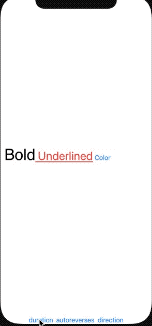
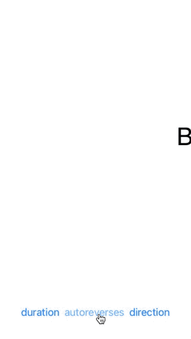
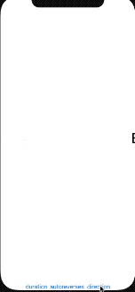

# Marquee

A powerful implementation of Marquee(scrolling text or label) in SwiftUI, which supports any content view, including text(label), image, video, etc.

## Features

- [x] Supports any content view powered by [ViewBuilder](https://developer.apple.com/documentation/swiftui/viewbuilder).
- [x] Supports **autoreverses**.
- [x] Supports custom **duration**.
- [x] Supports custom **direction**.
  - [x] left2right
  - [x] right2left

## Installation

### Swift Package Manager

In Xcode go to `File -> Swift Packages -> Add Package Dependency` and paste in the repo's url: <https://github.com/SwiftUIKit/Marquee>.

## Usage

### Any Content View

#### Text（Label）


```swift
import SwiftUI
import Marquee

struct ContentView: View {
    var body: some View {
        Marquee {
            Text("Hello World!")
                .fontWeight(.bold)
                .font(.system(size: 40))
        }
    }
}
```

#### Image


```swift
import SwiftUI
import Marquee

struct ContentView: View {
    var body: some View {
        Marquee {
            Image("test")
        }
    }
}
```

#### AttributedText


```swift
import SwiftUI
import Marquee

struct ContentView: View {
    var body: some View {
        Marquee {
            Text("Bold")
                .fontWeight(.bold)
                .font(.custom("SFUIDisplay-Light", size: 40))
                +
                Text(" Underlined")
                .font(.system(size: 30))
                .underline()
                .foregroundColor(.red)
                + Text(" Color")
                .foregroundColor(.blue)
        }
    }
}
```

### Animation Options

- duration



- autoreverses



- direction



```swift
import SwiftUI
import Marquee

struct ContentView: View {
    @State var duration: Double = 3.0
    @State var autoreverses: Bool = false
    @State var direction: MarqueeDirection = .right2left

    var body: some View {
        VStack {
            Marquee {
                VStack {
                    Text("Bold")
                        .fontWeight(.bold)
                        .font(.custom("SFUIDisplay-Light", size: 40))
                        +
                        Text(" Underlined")
                        .font(.system(size: 30))
                        .underline()
                        .foregroundColor(.red)
                        + Text(" Color")
                        .foregroundColor(.blue)
                }
            }.background(Color.white)
            .marqueeDuration(duration)
            .marqueeAutoreverses(autoreverses)
            .marqueeDirection(direction)

            Spacer()

            HStack {
                Button(action: {
                    self.duration = (duration == 3.0) ? 1.0 : 3.0
                }, label: {
                    Text("duration")
                })

                Button(action: {
                    self.autoreverses.toggle()
                }, label: {
                    Text("autoreverses")
                })

                Button(action: {
                    self.direction = (direction == .left2right) ? .right2left : .left2right
                }, label: {
                    Text("direction")
                })
            }.frame(height: 100)
        }.ignoresSafeArea()
    }
}
```
